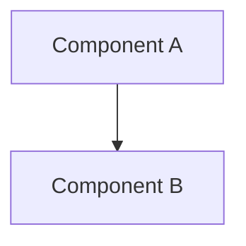
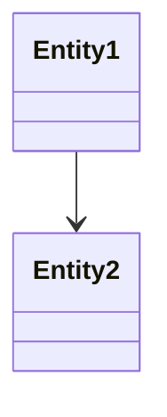

# Enrichment Catalog

The system stores enrichments in the `Enrichments` table, classified by `EnrichmentType` (5 broad categories) and `EnrichmentSubtype` (the specific kind). They are produced by handlers in `src/Andy.CodeIndex.Infrastructure/Handlers/`. Roughly half are mechanical (parse code/git), half are LLM-generated.

The LLM-backed handlers share `BaseLlmEnrichmentHandler` (`src/Andy.CodeIndex.Infrastructure/Handlers/LlmEnrichmentHandlers.cs:16`), which calls an OpenAI-compatible chat endpoint with `temperature=0.3`, `max_tokens=3000`, and feeds in up to 30 code chunks via `SummarizeChunks` (file path + first 300 chars per chunk, capped at ~8000 chars).

---

## Type: Development

### `Chunk` — Code snippets

- **Handler:** `ExtractSnippetsHandler.cs:14`
- **Production:** Lists files at the indexed commit via `IGitService.ListFilesAsync`, applies file filters, then runs `IChunkingService.ChunkText` per file. Uses skip-if-unchanged via blob SHA against the previous commit (`ExtractSnippetsHandler.cs:91-111`). Each chunk is stored with file path, language, start/end lines. Diffs are computed against existing chunks (added/updated/deleted/unchanged), so embeddings on unchanged chunks are preserved.
- **Prompt:** None — purely mechanical.

### `SnippetSummary` — Natural-language summaries of code

- **Handler:** `CreateSummaryEnrichmentsHandler` (`LlmEnrichmentHandlers.cs:289`)
- **Production:** LLM call over up to 30 sample `Chunk` enrichments.
- **Prompt:**

  ```
  Summarize the following code snippets from "{repo.Name}" into concise natural language descriptions.
  For each file mentioned, describe what it does in 1-2 sentences.
  Group by file path. Format as markdown.

  {SummarizeChunks(chunks)}
  ```

### `DocumentText` — Extracted PDF text

- **Handler:** `ExtractDocumentTextHandler.cs:14`
- **Production:** Walks files matching `.pdf`, picks the first registered `IDocumentParser` that handles the extension, and calls `parser.ParseAsync` on the file bytes. Long PDFs become one enrichment per page (Section), short PDFs become a single enrichment. Skip-if-unchanged via blob SHA. Skipped entirely if `DocumentParsingOptions.Enabled` is false.
- **Prompt:** None — uses the parser library.

### `Quality` — Test/quality analysis

- **Handler:** `CreateQualityDocsHandler.cs:13` (LLM, overrides `HandleAsync`)
- **Production:** Counts test files (path contains test/spec/Test), reads existing `Dependencies` enrichment for framework hints, scans for config files (`.editorconfig`, `.eslintrc*`, `.prettierrc*`, `tslint.json`, `sonar-project.properties`, `coverlet*`, `jest.config*`, `karma.conf*`, `.nycrc*`, `codecov.yml`), and pulls up to 20 chunks whose path matches `%test%` or `%spec%`. Then calls the LLM.
- **Prompt** (`CreateQualityDocsHandler.cs:103`):

  ```
  Analyze the quality and testing strategy of "{repo.Name}".

  File statistics:
  {stats}

  Quality/config files found:
  {qualityFiles or "None detected."}

  Test code samples:
  {SummarizeChunks(chunks, 4000)}

  Document:
  1. Test strategy: What types of tests exist (unit, integration, e2e, etc.)
  2. Test frameworks: What testing libraries and runners are used
  3. Coverage: Estimated coverage level and any coverage configuration
  4. Quality tools: Linters, formatters, static analysis
  5. CI quality gates: What checks run before merge
  6. Test patterns: Common patterns used in tests (arrange/act/assert, fixtures, mocks)
  7. Areas with weak coverage (inferred from file structure)
  8. Code quality signals: Code style consistency, documentation level

  If specific features are not found, say so.
  Format as markdown.
  ```

---

## Type: Architecture

### `Physical` — High-level architecture overview

- **Handler:** `CreateArchitectureDocsHandler` (`LlmEnrichmentHandlers.cs:187`)
- **Prompt:**

  ```
  Analyze the following code from the repository "{repo.Name}" and provide a high-level architecture overview.
  Include: main components, their responsibilities, how they interact, data flow, and key design patterns.
  Format as markdown.

  {SummarizeChunks(chunks)}
  ```

### `DatabaseSchema` — DB schema documentation

- **Handler:** `CreateDatabaseSchemaHandler` (`LlmEnrichmentHandlers.cs:207`)
- **Prompt:**

  ```
  Analyze the following code from "{repo.Name}" and document the database schema.
  Look for: entity classes, migrations, DbContext configurations, table definitions.
  Include: tables, columns, relationships, indexes, and constraints.
  If no database schema is found, say so. Format as markdown.

  {SummarizeChunks(chunks)}
  ```

### `Dependencies` — Package dependency table

- **Handler:** `ExtractDependenciesHandler.cs:14`
- **Production:** Walks files, picks ones `IDependencyParserService.CanParse` handles (e.g., `package.json`, `*.csproj`, `requirements.txt`), parses them, and renders a markdown table grouped by source. Quality is scored from package count.
- **Prompt:** None — purely parsed.

### `Security` — Security analysis

- **Handler:** `CreateSecurityDocsHandler.cs:12` (LLM, overrides `HandleAsync`)
- **Production:** Filters chunks whose path contains Auth/Security/Middleware/Guard/Permission/Encrypt/Token/.env/secret. Falls back to general chunks if fewer than 5 matches.
- **Prompt** (`CreateSecurityDocsHandler.cs:107`):

  ```
  Analyze the security architecture of "{repo.Name}".

  Document:
  1. Authentication: How users/services authenticate (JWT, OAuth, API keys, etc.)
  2. Authorization: How permissions and access control work (RBAC, policies, guards)
  3. Secrets management: How API keys, credentials, and secrets are stored and accessed
  4. Input validation: What validation and sanitization patterns are used
  5. Encryption: What encryption is used for data at rest and in transit
  6. Security headers and CORS configuration
  7. Sensitive file paths (.env, credentials, certificates)
  8. Known security patterns and potential concerns

  If specific security features are not found, say so clearly.
  Format as markdown.

  {SummarizeChunks(chunks)}
  ```

### `Ownership` — Ownership/maintainer analysis

- **Handler:** `CreateOwnershipDocsHandler.cs:13` (LLM, base flow)
- **Production:** Looks for a `CODEOWNERS` chunk and embeds it.
- **Prompt** (`CreateOwnershipDocsHandler.cs:40`):

  ```
  Analyze the repository "{repo.Name}" and document its ownership and collaboration structure.

  CODEOWNERS file:
  {codeownersContent or "No CODEOWNERS file found."}

  Based on the code structure below, identify:
  1. Primary maintainers and their areas of responsibility
  2. Team or organizational ownership patterns
  3. Areas with clear vs ambiguous ownership
  4. Contribution workflow (if visible from code structure)
  5. Key reviewers and subject matter experts (inferred from code organization)

  Format as markdown with clear sections.

  {SummarizeChunks(chunks)}
  ```

---

## Type: History

### `CommitHistory` — Commits + tags markdown table

- **Handler:** `ExtractCommitHistoryHandler.cs:13`
- **Production:** Calls `IGitService.GetCommitsAsync(limit: 200)` and `GetTagsAsync`, renders a markdown table with date/author/message/SHA. Quality scored from commit count.
- **Prompt:** None — purely git data.

### `CommitDescription` — Project history narrative

- **Handler:** `CreateCommitDescriptionHandler` (`LlmEnrichmentHandlers.cs:228`)
- **Prompt:**

  ```
  Based on the code structure of "{repo.Name}", describe the development history and evolution.
  What are the main features? What technologies are used? What's the overall project purpose?
  Format as markdown.

  {SummarizeChunks(chunks)}
  ```

---

## Type: Usage

### `Cookbook` — Getting-started cookbook

- **Handler:** `CreateCookbookHandler` (`LlmEnrichmentHandlers.cs:248`)
- **Prompt:**

  ```
  Create a cookbook/getting-started guide for the repository "{repo.Name}".
  Include: how to set up the project, common usage patterns, code examples,
  configuration, and best practices. Format as markdown with code blocks.

  {SummarizeChunks(chunks)}
  ```

### `Wiki` — Multi-section wiki

- **Handler:** `CreateWikiHandler` (`LlmEnrichmentHandlers.cs:268`)
- **Prompt:**

  ```
  Create comprehensive wiki documentation for the repository "{repo.Name}".
  Include sections: Overview, Architecture, API Reference, Configuration,
  Deployment, Testing, and Troubleshooting.
  Format as markdown with a table of contents at the top.

  {SummarizeChunks(chunks)}
  ```

### `APIDocs` — Per-file public API reference

- **Handler:** `CreateApiDocsHandler.cs:10`
- **Production:** For each file whose language is supported by `ICodeAnalysisService`, parses classes/interfaces/functions/enums and renders structured API docs via `GenerateApiDocs(analysis)`. One enrichment per file.
- **Prompt:** None — derived from a deterministic code analyzer.

### `Operations` — Deployment/CI analysis

- **Handler:** `CreateOperationsDocsHandler.cs:13` (LLM, overrides `HandleAsync`)
- **Production:** Scans for ops files (`Dockerfile`, `docker-compose*`, `.github/workflows/*`, `Jenkinsfile`, `azure-pipelines*`, `.gitlab-ci*`, `Makefile`, `Procfile`, `*.tf`, `*.helm*`, `fly.toml`, `railway.json`, `nixpacks.toml`), reads up to 3 files per pattern (truncated to 1500 chars), and adds 15 chunks for context.
- **Prompt** (`CreateOperationsDocsHandler.cs:86`):

  ```
  Analyze the operations and deployment setup of "{repo.Name}".

  Operations-related files found:
  {opsFiles or "No CI/CD or deployment files detected."}

  Code context:
  {SummarizeChunks(chunks, 4000)}

  Document:
  1. Build and CI/CD: What pipelines exist, what they do, how builds are triggered
  2. Containerization: Docker setup, base images, multi-stage builds
  3. Deployment: Where and how the application is deployed
  4. Infrastructure: Any IaC (Terraform, Helm, CloudFormation)
  5. Monitoring: Health checks, logging, metrics, tracing setup
  6. Environment management: How different environments are configured
  7. Database migrations: How schema changes are applied
  8. Background jobs and scheduled tasks

  If specific features are not found, say so.
  Format as markdown.
  ```

---

## Type: Insights

These are produced by `InsightsHandler.cs:13`, which loops over 11 layers in one task. Before generating, it loads "existing context" (concatenated content of `Physical`, `Dependencies`, `Wiki`, `Quality`, `Security`, `Operations`, `Ownership`, `CommitHistory`, `TechStack`, each truncated to 3000 chars) plus 30 sample code chunks. Every layer prompt is prefixed with this system instruction (`InsightsHandler.cs:91`):

```
You are an expert code analyst. You have FULL ACCESS to this repository's code and documentation — it is provided below in the "Existing knowledge" and "Code samples" sections. You MUST use this provided data to produce your analysis.

CRITICAL RULES:
- You ALREADY HAVE all the code and data you need. Do NOT ask for more information or repository access.
- Do NOT say "Repository access required" or "Please provide" — everything is provided below.
- Output ONLY the requested content in well-formatted markdown.
- Do NOT include any preamble, explanation, or meta-commentary.
- Start directly with headings, tables, lists, and diagrams.
- Be specific — reference actual file names, class names, and patterns from the provided code.
- If the provided context is insufficient for a specific detail, make your best inference and note the uncertainty.
```

Each layer also gets `=== REPOSITORY DATA ===` (existing context) and `=== SOURCE CODE ===` (code chunks) appended. The 11 layer-specific prompts, from `InsightsHandler.GetInsightLayers` (`InsightsHandler.cs:192`):

### `FeatureMap`

```
Using the data above, create a comprehensive feature inventory for "{repoName}".
List ALL features and capabilities — aim for at least 10-20 features.
Look at controllers, services, API endpoints, UI components, CLI commands, background jobs, integrations.
For each feature, assign a stable ID in format feat:[category]:[name].

Present as a markdown table with columns: ID, Feature Name, Description, Entry Files, Status (active/deprecated), Complexity (low/medium/high).
Group features by category with section headings.
```

### `ArchitectureAnalysis`

````
Create a detailed technical architecture analysis of "{repoName}".
Include:
1. Architecture overview (layers, components, their responsibilities)
2. Communication patterns (HTTP, gRPC, message queues, etc.)
3. Data flow (how data moves through the system)
4. External integrations

You MUST include at least one Mermaid diagram. Use this format:

Prefer graph TD, flowchart, or C4 component diagrams. Make them detailed with real component names from the codebase.
Format as markdown.
````

### `DesignAnalysis`

````
Analyze the technical design of "{repoName}" in detail.
Include:
1. Domain model — entities and their relationships
2. API surface — endpoints, methods, authentication
3. Design patterns used (MVC, Repository, CQRS, etc.)
4. Error handling approach
5. State management

You MUST include a Mermaid class diagram or ER diagram showing the domain model:

Use real entity names from the codebase. Format as markdown.
````

### `ImplementationAnalysis`

```
Analyze the implementation quality of "{repoName}".
Identify: key code patterns, code smells, cross-language consistency, top 5 improvement suggestions with effort/impact.
Format as markdown.
```

### `DependencyAnalysis`

```
Analyze all dependencies of "{repoName}".
Include: dependency count, categories (runtime/dev/test), potentially outdated packages, license types, security advisories if detectable.
Format as markdown.
```

### `TestAnalysis`

```
Analyze the testing strategy of "{repoName}".
Include: test pyramid shape (unit/integration/e2e counts), test frameworks, coverage estimate, testing patterns, gaps, top 3 testing improvements.
Format as markdown.
```

### `SecurityAnalysis`

```
Perform a security analysis of "{repoName}".
Check: authentication patterns, secrets handling, input validation, OWASP Top 10 exposure, security headers, rate limiting.
Rate each area risk 1-5.
Format as markdown.
```

### `DeploymentAnalysis`

````
Analyze the deployment and CI/CD setup of "{repoName}".
Include: pipeline description (Mermaid flowchart), environments, release process, containerization, infrastructure-as-code.
Include a ```mermaid block with a flowchart.
Format as markdown.
````

### `OperationsAnalysis`

```
Audit the operational readiness of "{repoName}".
Check: logging patterns (correct levels, no PII), monitoring, health checks, alerting, error handling, graceful shutdown.
Format as markdown.
```

### `LocalSetupGuide`

```
Generate a getting-started guide for "{repoName}".
Include: prerequisites, step-by-step setup, running tests, common issues, environment variables needed.
Format as markdown.
```

### `TechStack` (within InsightsHandler)

```
Summarize the technology stack of "{repoName}" in a concise markdown format.
Include: Backend frameworks + versions, Frontend frameworks + versions,
Database technologies, Infrastructure (Docker, K8s, CI/CD), Languages breakdown,
and Key Dependencies with versions.
Output ONLY markdown. No preamble. Be specific with version numbers.
```

### `TechStack` (dedicated `TechStackHandler.cs:13`)

A separate handler invoked by `TaskOperation.CreateTechStack`. It builds its own structured input rather than reusing `existingContext`: language breakdown table from file extensions, dependency content (truncated to 3000 chars), and config files content. Config patterns: `*.csproj`, `package.json`, `go.mod`, `Cargo.toml`, `docker-compose.{yml,yaml}`, `Dockerfile`, `angular.json`, `.github/workflows/*.{yml,yaml}`, `Jenkinsfile`, `.gitlab-ci.yml`, `requirements.txt`, `pyproject.toml`, `pom.xml`, `build.gradle` (capped at 15 files, 2000 chars each).

**Prompt** (`TechStackHandler.cs:83`):

```
Analyze the technology stack of the repository "{repo.Name}" based on the information below.
Output ONLY markdown. No preamble. Be specific with version numbers.

Produce a structured summary with the following sections:

## Backend
Detected backend framework(s) and version(s). Include the runtime (e.g., .NET 8, Node.js 20, Go 1.21).

## Frontend
Detected frontend framework(s) and version(s) (e.g., Angular 17, React 18).

## Database
Detected database technologies from docker-compose, connection strings, ORM configs.

## Infrastructure
Docker, Kubernetes, CI/CD tools detected from config files.

## Languages
Breakdown with file counts (use the data provided).

## Key Dependencies
Major packages with versions from the dependency data.

=== Language Breakdown ===
{languageBreakdown}

=== Dependencies ===
{depsContext}

=== Config Files ===
{configContext}
```

### `InsightReport` — Cached scored report

- **Producer:** `ReportService.cs` (`GenerateReportAsync`, `CallLlmForAnalysisAsync` at line 178). Not produced by a task handler — generated on-demand by the report endpoint and cached as an enrichment via `CacheReportAsync`.
- **Production:** Loads all 11 insight enrichments, truncates each to 1500 chars, asks the LLM for ratings/strengths/weaknesses/recommendations as JSON, then merges with velocity calculated from the commits table and tech stack data. The `InsightsHandler` deletes any cached `InsightReport` after each regeneration so the next request rebuilds it.
- **Prompt** (`ReportService.cs:197`):

  ```
  You are analyzing insight layers for the repository "{repoName}".
  Rate EVERY layer and provide constructive feedback.

  CRITICAL: You MUST include ALL {N} layers in your response: {layerSubtypes}
  Do NOT skip any layers. Each layer MUST have ratings, strengths, weaknesses, and recommendations.

  IMPORTANT: Return ONLY a valid JSON object. No preamble, no explanation, no markdown fencing, no text before or after the JSON.

  JSON structure:
  - overallHealthScore: number 0-100
  - layers: array of objects, each with:
    - subtype: string (e.g., "FeatureMap")
    - maturityRating: number 1-5
    - qualityRating: number 1-5
    - riskRating: number 1-5
    - strengths: array of 3 strings (specific, referencing actual code/patterns found)
    - weaknesses: array of 3 strings (specific, with concrete examples)
    - recommendations: array of 3 strings (actionable, prioritized)
  - improvements: array of 5 objects with title, description, layer, impact (high/medium/low), effort (high/medium/low)

  Base your analysis on the actual content below — be specific, not generic.

  Insight contents:
  {insights formatted as "=== {Name} ({Subtype}) ===\n{content (truncated to 1500 chars)}"}
  ```

---

## Side handlers (no enrichments stored)

A few handlers in the same folder don't write `Enrichment` rows but support the pipeline:

- **`CreateBM25IndexHandler.cs:9`** — no-op verifier; the BM25 index is a `tsvector` computed column on the `Enrichments` table, so it just logs the count.
- **`CreateCodeEmbeddingsHandler.cs:12`** — embeds `Chunk` enrichments into `ContentEmbeddings` with `IndexType.Code`.
- **`CreateSummaryEmbeddingsHandler.cs:10`** — embeds all non-Development enrichments into `ContentEmbeddings` with `IndexType.Text`.

## Subtypes defined but unused

`Snippet`, `Example`, `ExampleSummary` are in `EnrichmentSubtype.cs` but never written by any handler in the current code.

## Quality scoring

LLM-generated enrichments get a `Quality` score from `BaseLlmEnrichmentHandler.EstimateQuality` (`LlmEnrichmentHandlers.cs:144`), based on length and the presence of low-quality phrases like "no information available", "unable to determine", "could not find", etc. Mechanical enrichments (`CommitHistory`, `Dependencies`) score from item counts.
